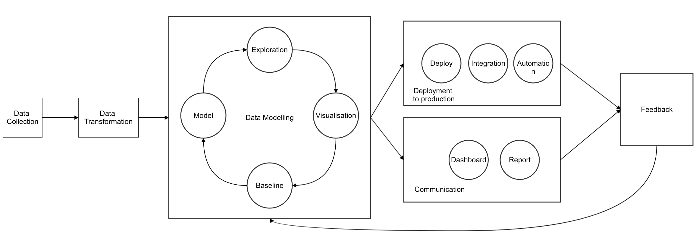
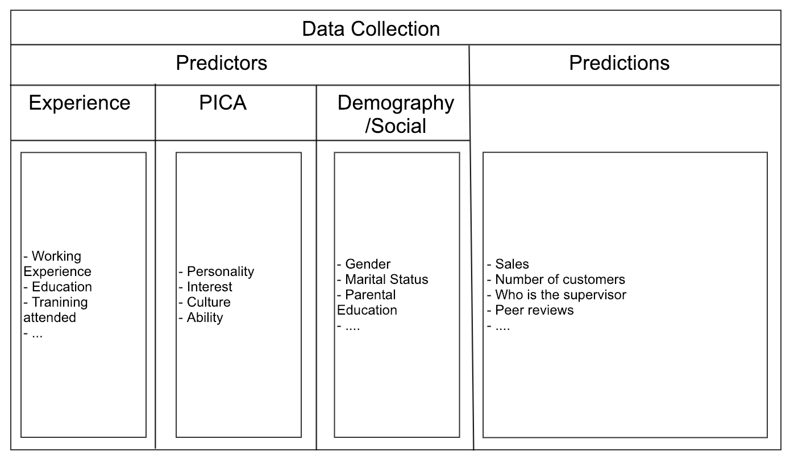
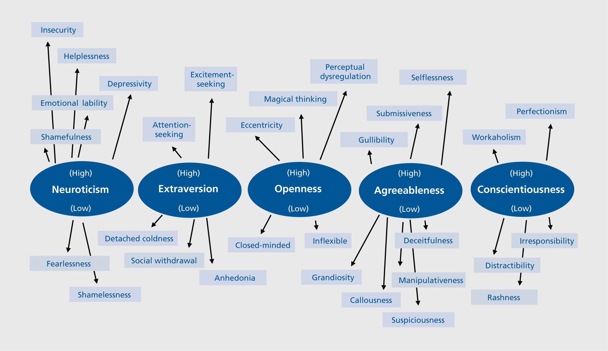

General Data Science Workflow
==============================

1. Problem statements
  - Decide the actual problme
  - Decide what data is needed
2. Data Collection
  - Design the data collection pipeline
  - Ensure the quality of data collected
3. Data Cleaning/Transformation
  - Transform the data into suitable format for analysis
4. Data Analysis
  - Exploratory Data Analysis
    - to get a feeling how the data look like
    - check for anomalies/pattern
    - visualisation
  - Baseline Modelling
    - Build a most simple model to explain the data
    - Any further complicated model should out perform this or else is useless
    - sense check
  - Model Building
    - Using suitable statistical/machine learning model in this stage to squeeze out the performance
    - Cross-validation
    - Select the best model
5. Result
  - Report/Dashboard
  - Visualisation
  - Automation

Data Points
===========

The data points we are going to collect are divided into 2 major categories
1. Predictors - those we are using to predict job performance
2. Prediction - those that constitute job performance (what we want to measure ultimately)

The predictors are those we believe to influence job performance and reflect our view about holistic evauluation.
- Experience
- PICA
- Demography
- Social Status

The prediction shows our willingness to measure beyond sales number as a proxy of the job performance. We are also considering social interaction with peers and supervisors as a more holistic view of job performance.

Predictor
---------

Experience
----------
1. Previous Working experience
  - any relevant job before joining
  - newly join/rejoin?
2. Education
  - Level
  - Major
  - University
3.

Psychology Framework
--------------------
1.Personality
  - social media footprint: https://www.sciencedirect.com/science/article/pii/S0191886917307328
  - self-report assessment

2. Interest: https://www.jstor.org/stable/41613576
  -  self-report assessment

3. Culture
  - self-report assessment

4. Cognitive Ability : https://www.ncbi.nlm.nih.gov/pubmed/14717634
  - self-report assessment
  - all demographic data: https://homepages.abdn.ac.uk/j.crawford/pages/dept/pdfs/BJCP_1989_Demographic_Premorbid_IQ.pdf

Demographic
-----------
1. Gender -https://www.sciencedirect.com/science/article/pii/S0191886917307328
2. Marital Status
  - at the time of joining
  - current status
3. Social Economic Status - https://opensiuc.lib.siu.edu/cgi/viewcontent.cgi?article=2276&context=theses
  - parental education/job

Prediction
----------
1. Sales
2. Number of customers
3. Managers
4. Peer review
5. Job Satisfaction

Notes
=====

